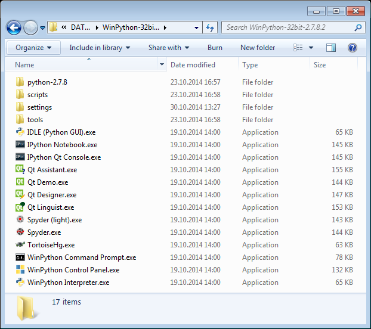

Winpython comes with quite a few included programs, here is a list with some explanations:

  * [IDLE](https://docs.python.org/library/idle.html) (`IDLE (Python GUI).exe`) -  The standard Python console interpreter window
  * [IPython Notebook](http://ipython.org/notebook.html) (`IPython Notebook.exe`) - To create, work on and display IPython Notebooks 
  * [IPython Qt Console](http://ipython.org/ipython-doc/stable/interactive/qtconsole.html) (`IPython Qt Console.exe`) - The Ipython (*Improved Python*) Console
  * [Qt Assistant](https://qt-project.org/doc/qt-4.8/assistant-manual.html) (`Qt Assistant.exe`) - Presenting documentation
  * [Qt Demo](http://qt-project.org/doc/qt-4.8/qtdemo.html) (`Qt Demo.exe`) - Usage examples of qt
  * [Qt Designer](https://qt-project.org/doc/qt-4.8/designer-manual.html) (`Qt Designer.exe`) - Create Qt-GUIs
  * [Qt Linguist](https://qt-project.org/doc/qt-4.8/linguist-manual.html) (`Qt Linguist.exe`) - Translating Qt programs
  * [Spyder light] (`Spyder (light).exe`) - Spyder will be started without loading Addons automatically
  * [Spyder](https://pythonhosted.org/spyder/) (`Spyder.exe`) - Most popular Python-IDE in the scientific context.
  * [Tortoise HG](http://tortoisehg.bitbucket.org/) (`TortoiseHG.exe`) - GUI for Mercurial Version Control System. Will be removed in next (December) release!
  * WinPython Command Promt (`WinPyton Command Prompt.exe`) - A command shell with loaded Winpython programs (all installed programs too, e.g. pip, nose, etc.)
  * [[WinPython Control Panel]] (`WinPyton Control Panel.exe`)
  * WinPython Interpreter (`WinPyton Interpreter.exe`)

