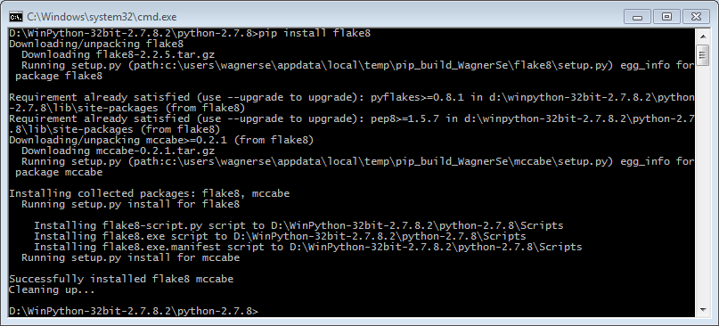

To install python packages that are not included in Winpython.

# Installing a Precompiled Wheel Package (not using the Pypi version)

Download the binary Wheel (.whl format):
- from [Gohlke's Unoffical Windows Binaries for Python Extension Packages](http://www.lfd.uci.edu/~gohlke/pythonlibs/), the default provider of Winpython packages,
- or from other places you trust like github. 

Then, select the downloaded package via *Winpython Package Manager* (WPPM) (in your Winpython directory) and install it.

It is also possible to open any downloaded packages (usually `.tar.gz` or `.zip`) files containing the Python-files) in the WPPM to install them.


# Installing via `pip`

Using the *Winpython Command Prompt* you are able to use [*pip*](https://pip.readthedocs.org/en/latest/) directly to install packages from [PyPI](http://pypi.python.org/) for example:

```bash
pip install flake8
```



Since Winpython of March 2015, packages installed via `pip` will also visible in the (WPPM).